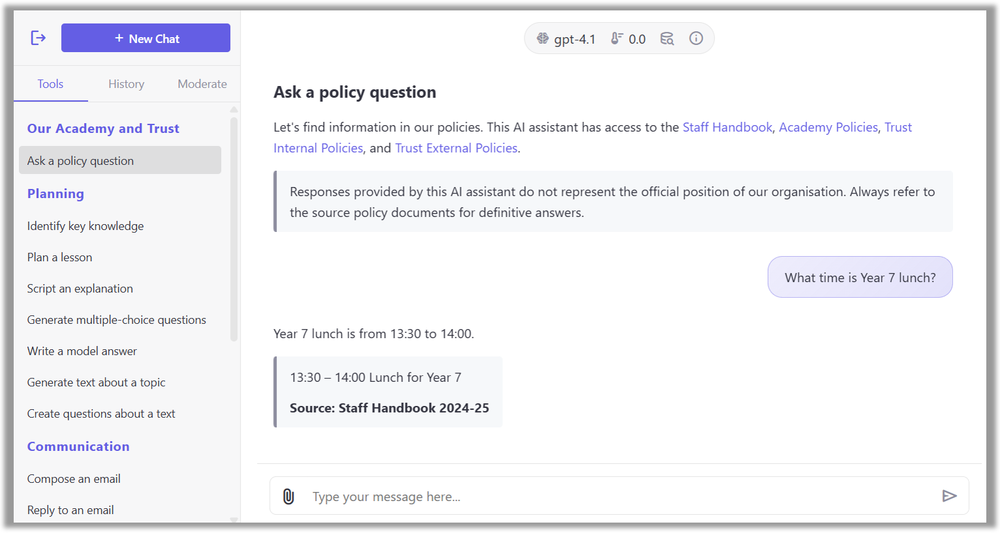

# Organisation AI

Organisation AI is a free, open-source web application that empowers your entire organisation with access to advanced AI chat capabilities&mdash;without the burden of costly per-user licenses.

Deploy effortlessly to Microsoft Azure and run OpenAI models hosted in Azure AI Foundry.



Originally known as *Teacher AI* for its focus on supporting staff in schools, this app has been upgraded to meet the needs of any organisation, from businesses to nonprofits.

### Features

* A clean, professional chat interface
* Access to the latest OpenAI language models
* Customisable prompt presets for different teams
* Understanding of uploaded images
* Voice-to-voice conversations
* Chat history
* Automated content moderation and manual review
* Configurable weekly spend limits
* Usage and cost dashboard
* Support for all screen sizes including mobile
* Single sign-on (SSO) using Microsoft 365

### Setup

1. Create an [Azure AI Foundry](https://ai.azure.com/) project and deploy the OpenAI models that you would like to use.

2. Create a general purpose v2 storage account in Microsoft Azure, and within it create:
    * Tables: `conversations`, `spend`, and `review`
    * Blob containers: `conversations` and `config`

3. Within the `config` blob container, upload a blank file `keys.xml`. Generate a SAS URL for this file with read/write permissions and a distant expiry. This will be used to store the application's data protection keys so that auth cookies persist across app restarts.


4. Within the `config` blob container, create a file `users.csv` with the following format:

    ```csv
    Email,UserGroup
    test@example.com,staff
    ```

5. For each user group configured in `users.csv`, create a file `<usergroup>.json` with the following format:

    ```json
    {
      "allowUploads": true,
      "introMessage": "This service is for work-related queries only.",
      "presets": [
        {
          "id": "default",
          "title": null,
          "category": null,
          "introduction": null,
          "instructions": "You are a helpful AI assistant.",
          "model": "gpt-5",
          "temperature": null,
          "reasoningEffort": "minimal",
          "voice": null
        }
      ],
      "reviewers": [ "reviewer@example.com" ],
      "showPresetDetails": true,
      "stopCommands": [
        "token": "[offtopic]",
        "message": "This is off-topic."
      ],
      "userMaxWeeklySpend": 2.00
    }
    ```

    Our [examples](examples) folder contains sample configuration files for a secondary school.

    The settings are:

    * `allowUploads` - whether users in this group can upload files
    * `introMessage` - a message to display to users on the homepage in Markdown format, e.g. you may include a link to your organisation's AI policy
    * `presets` - an array of preset prompt templates that will be available to users from the sidebar
        * `id` - the ID of the preset, which is a unique string without spaces; use the ID `default` to specify the default preset which loads at the start
        * `title` - the title of the preset, displayed in the sidebar
        * `category` - the category of the preset, displayed as a heading in the sidebar
        * `introduction` - the message to display when this preset is selected, in Markdown format (note that this is not sent to the language model)
        * `instructions` - the system instructions to send to the language model along with the user's message
        * `model` - the OpenAI model to use for this preset, as configured below
        * `temperature` (optional) - the temperature to use, where supported by the model
        * `reasoningEffort` (optional) - the reasoning effort to use, where supported by the model
        * `voice` (optional) - when set, this enables speech-to-speech mode using the specified voice
    * `reviewers` - an array of users to give reviewer access, which allows them to retrospectively review all AI conversations in this group
    * `showPresetDetails` - whether to show the preset details, such as the system instructions and model name, to the user
    * `stopCommands` - specific strings that, if received from the language model, will stop the conversation and display a customised message; this needs to be used in conjunction with the model `instructions` above, and can be useful for safety purposes
        * `token` - the exact text to match in the language model's output (e.g. `[OFF TOPIC]`)
        * `message` - the warning to display to the user, in Markdown format
    * `userMaxWeeklySpend` - the amount each user is allowed to spend per week; resets Sundays (OpenAI token usage is retrospective, so users might slightly exceed the limit before restrictions apply)
 
6. Create an Azure app registration.
    * Name - `Organisation AI`
    * Redirect URI - `https://<app-website-domain>/signin-oidc`
    * Implicit grant - ID tokens
    * Supported account types - Accounts in this organizational directory only
    * API permissions - `Microsoft Graph - User.Read`
    * Token configuration - add an optional claim of type ID: `upn`
    * Certificates & secrets - create a new client secret

7. Create an Azure App Service web app.
    * Publish mode - Container
    * Operating system - Linux
    * Image source - Other container registries
    * Docker Hub access type - Public
    * Image and tag - `jamesgurung/organisation-ai:latest`
    * Startup command: (blank)

8. Configure the following environment variables for the web app:

    * `Azure__ClientId` - the client ID of your Azure app registration
    * `Azure__ClientSecret` - the client secret of your Azure app registration
    * `Azure__DataProtectionBlobUri` - the SAS URL for the keys file you created earlier
    * `Azure__StorageAccountKey` - the key for your Azure Storage account
    * `Azure__StorageAccountName` - the name of your Azure Storage account
    * `Azure__TenantId` - your Azure tenant ID
    * `OpenAI__AIFoundryApiKey` - the API key for your Azure AI Foundry project
    * `OpenAI__AIFoundryEndpoint` - the endpoint URL for your Azure AI Foundry deployment, e.g. `https://<project>.cognitiveservices.azure.com/`
    * `OpenAI__CostPer1KFileSearches` - the OpenAI credit cost per 1K file searches
    * `OpenAI__Models__0__Name` - the name of the Azure AI Foundry OpenAI deployment you would like to make available, e.g. `gpt-4.1` (subsequent models can be configured by adding additional items with incrementing indices)
    * `OpenAI__Models__0__CostPer1MAudioInputTokens` - the model cost per 1M audio input tokens (where applicable)
    * `OpenAI__Models__0__CostPer1MAudioOutputTokens` - the model cost per 1M audio output tokens (where applicable)
    * `OpenAI__Models__0__CostPer1MCachedInputTokens` - the model cost per 1M cached input tokens
    * `OpenAI__Models__0__CostPer1MInputTokens` - the model cost per 1M input tokens
    * `OpenAI__Models__0__CostPer1MOutputTokens` - the model cost per 1M output tokens
    * `OpenAI__TitleSummarisationModel` - the deployment which will be used to summarise titles, e.g. `gpt-4.1-mini`
    * `Organisation__AppWebsite` - the host name where this app will be hosted, e.g. `example.com`
    * `Organisation__Name` - the name of your organisation
    * `Organisation__SyncApiKey` - a secret key to be used when updating the `users.csv` file with an automated script (optional)

### Updating configuration files

To make changes to users or user groups after deployment, you can edit the files in the `config` blob container. A user with reviewer access must then navigate to `/api/refresh` for the changes to take effect.

### Contributing

If you have a question or feature request, please open an issue.

To contribute improvements to this project, or to adapt the code for the specific needs of your organisation, you are welcome to fork the repository.

Pull requests are welcome; please open an issue first to discuss.